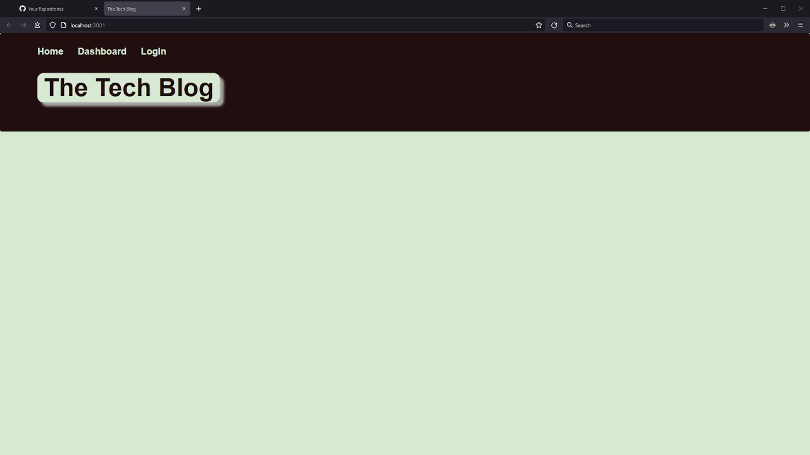

# CMS-Style Blog Site

[](https://opensource.org/licenses/MIT)

## Description
This application is a CMS-style blog site, created in a manner following the MVC paradigm. It is written in JavaScript and runs on Node with an Express API to interact with a MySQL database. Packages used include mysql2, Sequelize, dotenv, express-session, connect-session-sequelize, bcrypt, and express-handlebars.



## Table of Contents
- [Link to Deployed Application](#link-to-deployed-application)
- [User Story](#user-story)
- [Installation](#installation)
- [Usage](#usage)
- [Tests](#tests)
- [Author](#author)
- [License](#license)
- [Contributing](#contributing)
- [Questions](#questions)

## Link to Deployed Application
The application is deployed using Heroku with JawsDB MySQL at the following URL:

[http://obscure-fjord-80382.herokuapp.com/](http://obscure-fjord-80382.herokuapp.com/)

## User Story
This tech blog site was created to meet the requirements of the following user story:
```
AS A developer who writes about tech
I WANT a CMS-style blog site
SO THAT I can publish articles, blog posts, and my thoughts and opinions
```

## Installation
1. Clone the repository, or download and extract an archive of it
2. Run "npm install" to obtain the required dependencies

## Usage
1. Create a .env file (reference .env.example) and populate it with your MySQL database information
2. Invoke the app with "npm run start" or "node server.js"
3. Visit http://localhost:3001 to begin using the site

## Tests
Run "npm run test" to execute the Jest test suite.

## Author
Application written by Daniel Birmingham ([GitHub profile](https://github.com/Prolix19/)).

## License
[The MIT License](https://opensource.org/licenses/MIT)

## Contributing
This project is not open to contributions at this time.

## Questions
You may reach me via email at 51418825+Prolix19@users.noreply.github.com with any additional questions you may have.
